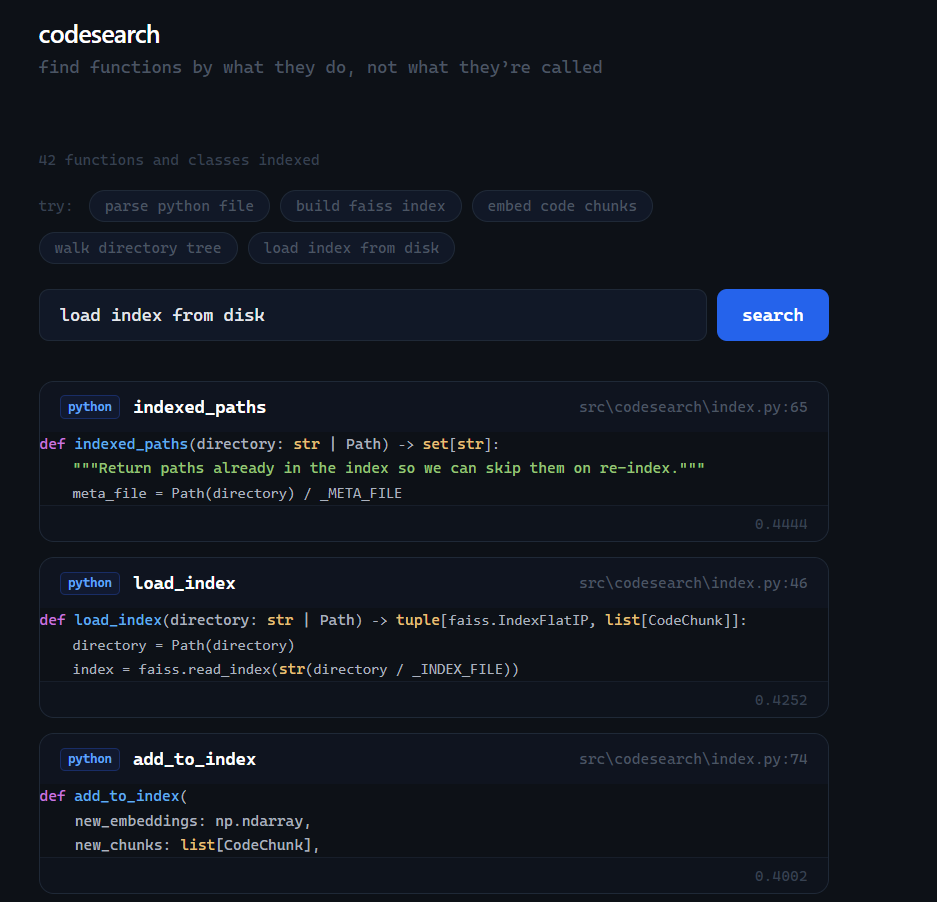

# codesearch

> find functions by what they *do*, not what they're *called*



## Why I built this

I was knee-deep in a Python codebase for a uni project and kept losing track of where
things lived. Grep is great for exact string matches but completely useless when you
can't remember the function name. Search for "auth" and you get 80 results. Search for
"the thing that validates the JWT and returns the user object" and you get nothing.

I'd been meaning to learn sentence-transformers and FAISS for ages so this became my
excuse. The idea is simple: parse the code with tree-sitter, embed each function/class
as a vector, throw it in a FAISS index. At query time, embed the query the same way
and find the closest vectors.

It works better than I expected honestly. It's not perfect and there are rough edges
but I've started actually using it day-to-day so that's something.

## Installation

```bash
pip install codesearch
```

Or if you're using uv (you should be):

```bash
uv add codesearch
```

## Quick start

```bash
# index your project first
codesearch index ./my-project

# then search it
codesearch query "parse json response from api"
```

## Commands

### `codesearch index <path>`

Walks the directory, extracts every function and class definition, embeds them, and
saves the FAISS index to `.codesearch/`. Runs incrementally by default — only new
files get processed on subsequent runs.

| Flag | Default | Description |
|------|---------|-------------|
| `--index-dir` | `.codesearch` | where to store the index |
| `--model` | `all-MiniLM-L6-v2` | which sentence-transformer to use |
| `--lang` | *(all)* | only index `python` or `javascript` |
| `--watch` | off | re-index automatically when files change |

```bash
codesearch index ./src --lang python
codesearch index . --watch   # keeps running, re-indexes on save
```

### `codesearch query <text>`

Embeds the query and returns the closest matches with a syntax-highlighted preview.

| Flag | Default | Description |
|------|---------|-------------|
| `--top` | `5` | how many results to show |
| `--index-dir` | `.codesearch` | where the index lives |
| `--lang` | *(all)* | filter results by language |

```bash
codesearch query "database connection pool" --top 10
codesearch query "authentication middleware" --lang python
codesearch query "onclick event handler" --lang javascript
```

## Example queries

These are the kinds of searches that made me want to build this:

1. **Can't remember the function name**
   ```bash
   codesearch query "retry failed request with exponential backoff"
   ```

2. **Looking for where something gets handled**
   ```bash
   codesearch query "normalize and flatten nested dictionary"
   ```

3. **Finding test helpers**
   ```bash
   codesearch query "mock http request in tests"
   ```

## How it works

1. **tree-sitter** parses `.py` / `.js` files and pulls out every function and class
   with its name and line range. Way more reliable than regex for this kind of thing.
2. **sentence-transformers** (`all-MiniLM-L6-v2`) turns each chunk's source text into
   a 384-dim vector. Results are cached by content hash so unchanged code isn't
   re-embedded when you re-run indexing.
3. **FAISS** (`IndexFlatIP`) stores the vectors and does fast nearest-neighbor search.
   Using inner product on normalized vectors gives cosine similarity.
4. At query time the query gets embedded the same way and the nearest neighbors come
   back with a 3-line preview.

## Known issues / stuff I want to fix

- no TypeScript support yet
- if you delete a file it stays in the index until you do a full rebuild
- `--watch` does a full re-index on each change instead of just the modified file
- haven't tested on really large codebases, might be slow

## Development

```bash
git clone https://github.com/siwaarbn/codesearch
cd codesearch
uv sync
uv run codesearch --help
```
